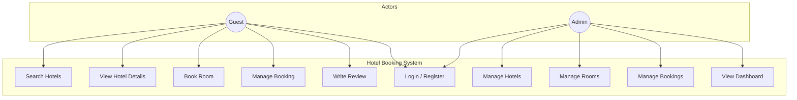
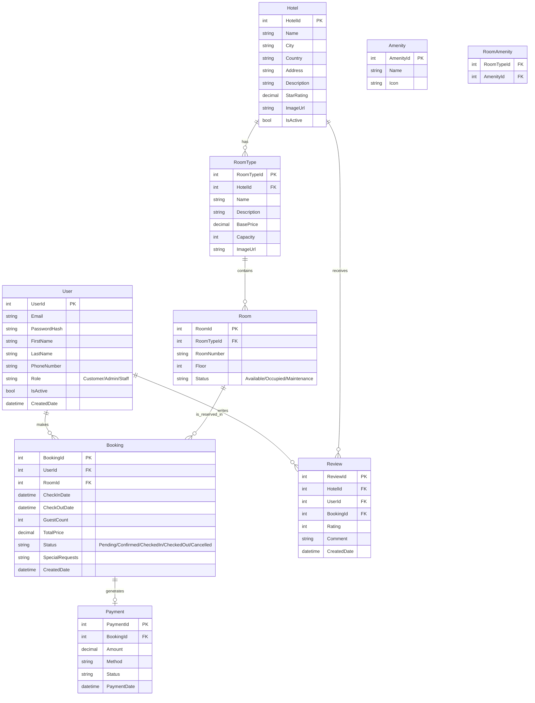
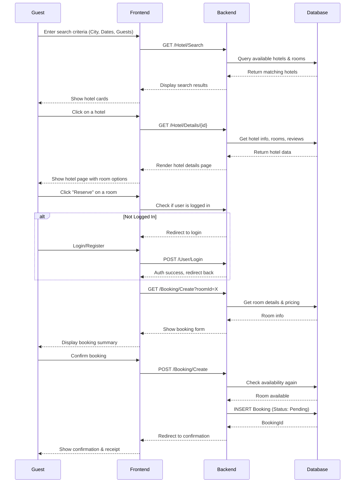
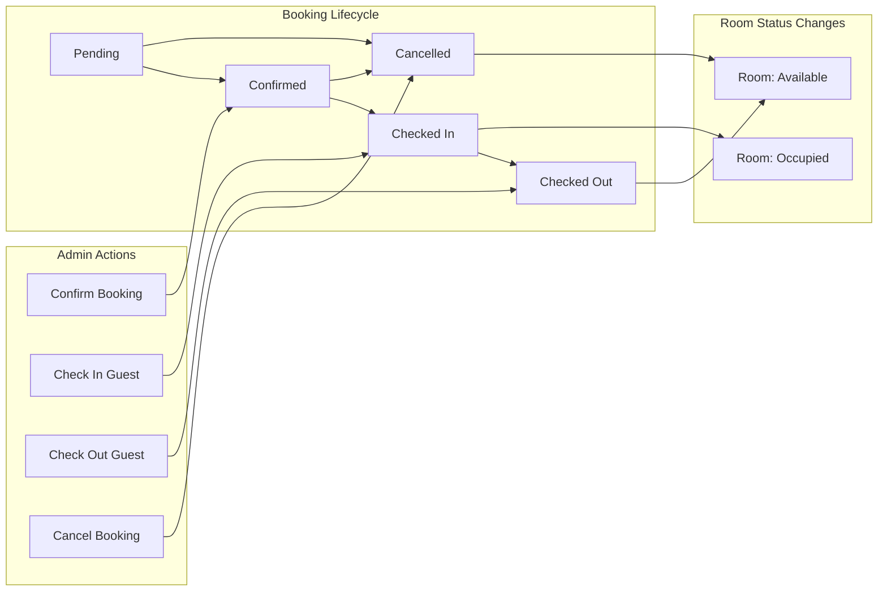
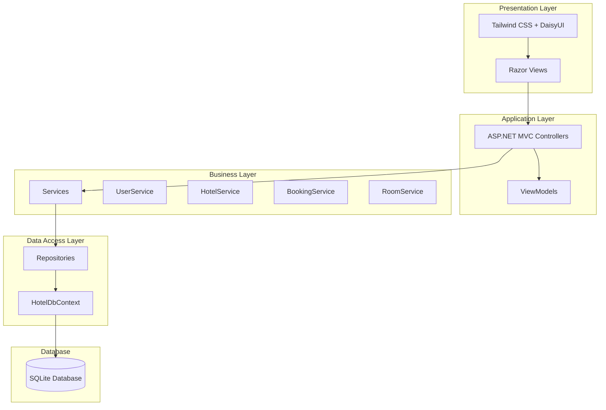

# System Design & Diagrams

This document contains the system architecture diagrams for the Hotel Booking application. All diagrams are written in Mermaid format and will render directly on GitHub.

---

## 1. Use Case Diagram

---

## 2. Entity Relationship Diagram (ERD)

---

## 3. User Flow: Booking Process

---

## 4. Admin Flow: Booking Management

---

## 5. System Architecture

---

## Technology Stack

| Layer | Technology |
|-------|------------|
| Frontend | Razor Views, Tailwind CSS, DaisyUI |
| Backend | ASP.NET Core MVC (.NET 10) |
| ORM | Entity Framework Core |
| Database | SQLite |
| Authentication | Cookie-based (Claims) |
| Architecture | Clean Architecture (3-Layer) |
