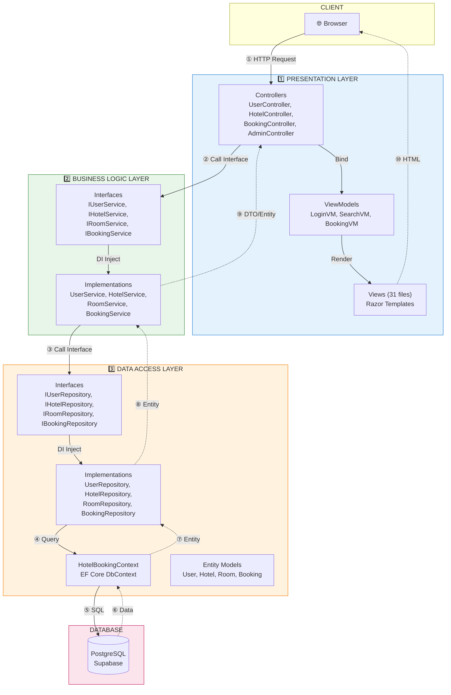

# Hotel Booking - 3-Layer Architecture

## Request/Response Flow



---

## Detailed Flow (2-Way)

```
┌─────────────────────────────────────────────────────────────────┐
│  BROWSER                                                         │
│  ① Request: POST /Login {email, password}                       │
│  ⑩ Response: HTML + Cookie                                      │
└─────────────────────────┬───────────────────────────────────────┘
                          │ ↓ Request    ↑ Response
┌─────────────────────────▼───────────────────────────────────────┐
│  1️⃣ PRESENTATION LAYER                                          │
│  ② Controller gọi IUserService.AuthenticateAsync()              │
│  ⑨ Nhận User entity → Tạo cookie → Render View                  │
└─────────────────────────┬───────────────────────────────────────┘
                          │ ↓ Request    ↑ Response
┌─────────────────────────▼───────────────────────────────────────┐
│  2️⃣ BUSINESS LOGIC LAYER                                        │
│  ③ Service gọi IUserRepository.GetByEmailAsync()                │
│  ⑧ Verify password → Return User hoặc null                     │
└─────────────────────────┬───────────────────────────────────────┘
                          │ ↓ Request    ↑ Response
┌─────────────────────────▼───────────────────────────────────────┐
│  3️⃣ DATA ACCESS LAYER                                           │
│  ④ Repository gọi DbContext.Users.FirstOrDefaultAsync()        │
│  ⑦ Return User entity                                           │
└─────────────────────────┬───────────────────────────────────────┘
                          │ ↓ SQL        ↑ Data
┌─────────────────────────▼───────────────────────────────────────┐
│  DATABASE                                                        │
│  ⑤ SELECT * FROM "Users" WHERE "Email" = @email                 │
│  ⑥ Return row data                                               │
└─────────────────────────────────────────────────────────────────┘
```

---

## Layer Responsibilities

| Layer | Request (↓) | Response (↑) |
|-------|-------------|--------------|
| **Presentation** | Nhận HTTP request, validate input | Return View/JSON/Redirect |
| **Business Logic** | Thực thi business rules | Return DTO/Entity/Exception |
| **Data Access** | Query database | Return Entity/Collection |
