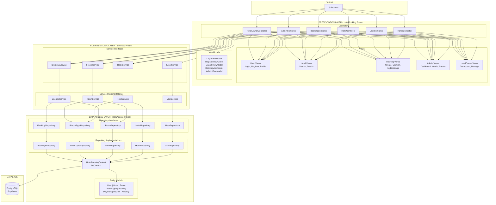

# Hotel Booking - 3-Layer Architecture

## System Architecture Overview



---

## Layer Details

### 1️⃣ Presentation Layer (`HotelBooking/`)

| Component | Files | Responsibility |
|-----------|-------|----------------|
| **Controllers** | 6 files | Handle HTTP requests, route to services |
| **Views** | 31 .cshtml files | Razor templates for UI rendering |
| **ViewModels** | 6 files | Data transfer objects for views |
| **Validation** | DateValidationAttributes.cs | Custom validation attributes |

### 2️⃣ Business Logic Layer (`Services/`)

| Interface | Implementation | Responsibility |
|-----------|----------------|----------------|
| `IUserService` | `UserService` | Auth, registration, profile |
| `IHotelService` | `HotelService` | Hotel CRUD, search, availability |
| `IRoomService` | `RoomService` | Room management, status |
| `IBookingService` | `BookingService` | Booking lifecycle, payments |

### 3️⃣ Data Access Layer (`DataAccess/`)

| Component | Files | Responsibility |
|-----------|-------|----------------|
| **Models** | 8 entity classes | Database schema representation |
| **Repositories** | 5 interfaces + 5 implementations | Data access abstraction |
| **Context** | HotelBookingContext | EF Core DbContext, Fluent API |
| **Migrations** | SQL scripts | Database versioning |

---

## Dependency Flow

```
┌─────────────────────────────────────────────────────────────┐
│                    PRESENTATION LAYER                        │
│  Controllers → ViewModels → Views                           │
│         ↓ (depends on)                                       │
├─────────────────────────────────────────────────────────────┤
│                  BUSINESS LOGIC LAYER                        │
│  IServices ← Services (implements)                          │
│         ↓ (depends on)                                       │
├─────────────────────────────────────────────────────────────┤
│                   DATA ACCESS LAYER                          │
│  IRepositories ← Repositories → DbContext → Database        │
└─────────────────────────────────────────────────────────────┘
```

---

## Dependency Injection (Program.cs)

```csharp
// Data Access Layer
builder.Services.AddDbContext<HotelBookingContext>();
builder.Services.AddScoped<IUserRepository, UserRepository>();
builder.Services.AddScoped<IHotelRepository, HotelRepository>();
builder.Services.AddScoped<IRoomRepository, RoomRepository>();
builder.Services.AddScoped<IRoomTypeRepository, RoomTypeRepository>();
builder.Services.AddScoped<IBookingRepository, BookingRepository>();

// Business Logic Layer
builder.Services.AddScoped<IUserService, UserService>();
builder.Services.AddScoped<IHotelService, HotelService>();
builder.Services.AddScoped<IRoomService, RoomService>();
builder.Services.AddScoped<IBookingService, BookingService>();
```

---

## Key Design Patterns

| Pattern | Implementation |
|---------|----------------|
| **Repository Pattern** | `IRepository<T>` base + specific repos |
| **Dependency Injection** | Constructor injection via DI container |
| **Interface Segregation** | Separate interfaces per domain |
| **MVC Pattern** | ASP.NET Core MVC architecture |
