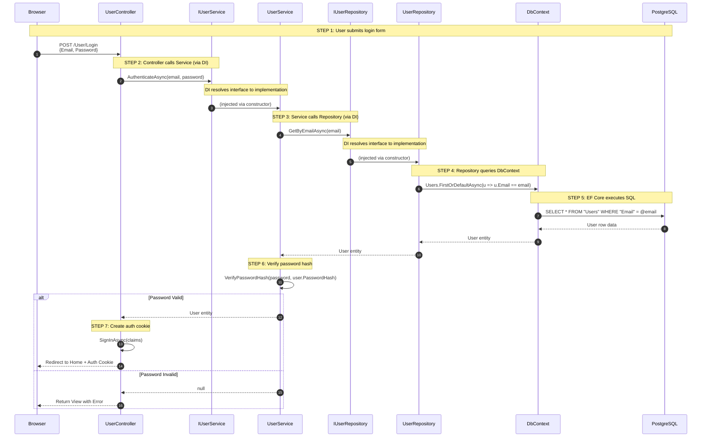

# Login Flow - 3-Layer Architecture with DI

## Sequence Diagram



---

## Code Flow Step-by-Step

### 🔵 STEP 1: Browser → Controller (Presentation Layer)

```csharp
// User/Login.cshtml - Form submits to controller
<form asp-action="Login" method="post">
    <input asp-for="Email" />
    <input asp-for="Password" type="password" />
    <button type="submit">Login</button>
</form>
```

### 🔵 STEP 2: Controller receives request

```csharp
// UserController.cs (Presentation Layer)
public class UserController : Controller
{
    private readonly IUserService _userService;  // ← DI injected
    
    // Constructor Injection - DI container provides IUserService
    public UserController(IUserService userService)
    {
        _userService = userService;
    }
    
    [HttpPost]
    public async Task<IActionResult> Login(LoginViewModel model)
    {
        // Validate ModelState
        if (!ModelState.IsValid)
            return View(model);
        
        // Call Business Logic Layer via interface
        var user = await _userService.AuthenticateAsync(model.Email, model.Password);
        
        if (user == null)
        {
            ModelState.AddModelError("", "Invalid email or password");
            return View(model);
        }
        
        // Create authentication cookie
        await SignInUserAsync(user);
        return RedirectToAction("Index", "Home");
    }
}
```

### 🟢 STEP 3: Service handles business logic

```csharp
// UserService.cs (Business Logic Layer)
public class UserService : IUserService
{
    private readonly IUserRepository _userRepository;  // ← DI injected
    
    // Constructor Injection - DI container provides IUserRepository
    public UserService(IUserRepository userRepository)
    {
        _userRepository = userRepository;
    }
    
    public async Task<User?> AuthenticateAsync(string email, string password)
    {
        // Call Data Access Layer via interface
        var user = await _userRepository.GetByEmailAsync(email);
        
        if (user == null)
            return null;
        
        // Business Logic: Verify password
        if (!BCrypt.Net.BCrypt.Verify(password, user.PasswordHash))
            return null;
        
        return user;
    }
}
```

### 🟠 STEP 4: Repository accesses database

```csharp
// UserRepository.cs (Data Access Layer)
public class UserRepository : Repository<User>, IUserRepository
{
    private readonly HotelBookingContext _context;  // ← DI injected
    
    public UserRepository(HotelBookingContext context) : base(context)
    {
        _context = context;
    }
    
    public async Task<User?> GetByEmailAsync(string email)
    {
        // Use EF Core to query database
        return await _context.Users
            .FirstOrDefaultAsync(u => u.Email == email);
    }
}
```

### 🔴 STEP 5: DbContext → PostgreSQL

```csharp
// HotelBookingContext.cs generates SQL:
// SELECT * FROM "Users" WHERE "Email" = 'user@example.com' LIMIT 1
```

---

## Dependency Injection Setup

```csharp
// Program.cs - DI Container Configuration
var builder = WebApplication.CreateBuilder(args);

// 1. Register Data Access Layer
builder.Services.AddDbContext<HotelBookingContext>(options =>
    options.UseNpgsql(connectionString));

builder.Services.AddScoped<IUserRepository, UserRepository>();

// 2. Register Business Logic Layer  
builder.Services.AddScoped<IUserService, UserService>();

// When UserController is created:
// 1. DI sees it needs IUserService
// 2. DI creates UserService (which needs IUserRepository)
// 3. DI creates UserRepository (which needs HotelBookingContext)
// 4. DI creates HotelBookingContext
// 5. All dependencies are injected via constructors
```

---

## Data Flow Summary

```
┌──────────────────────────────────────────────────────────────┐
│  BROWSER                                                      │
│  POST {email: "a@b.com", password: "123"}                    │
└──────────────────────────┬───────────────────────────────────┘
                           ▼
┌──────────────────────────────────────────────────────────────┐
│  1️⃣ PRESENTATION LAYER                                       │
│  UserController.Login(LoginViewModel)                        │
│       │                                                       │
│       ▼ calls IUserService (DI injected)                     │
└──────────────────────────┬───────────────────────────────────┘
                           ▼
┌──────────────────────────────────────────────────────────────┐
│  2️⃣ BUSINESS LOGIC LAYER                                     │
│  UserService.AuthenticateAsync(email, password)              │
│       │                                                       │
│       ├─ calls IUserRepository.GetByEmailAsync()             │
│       └─ verifies password hash (business logic)             │
└──────────────────────────┬───────────────────────────────────┘
                           ▼
┌──────────────────────────────────────────────────────────────┐
│  3️⃣ DATA ACCESS LAYER                                        │
│  UserRepository.GetByEmailAsync(email)                       │
│       │                                                       │
│       ▼ uses HotelBookingContext (EF Core)                   │
│  _context.Users.FirstOrDefaultAsync(u => u.Email == email)   │
└──────────────────────────┬───────────────────────────────────┘
                           ▼
┌──────────────────────────────────────────────────────────────┐
│  DATABASE                                                     │
│  PostgreSQL: SELECT * FROM "Users" WHERE "Email" = @email    │
└──────────────────────────────────────────────────────────────┘
```

---

## Benefits of This Architecture

| Benefit | Explanation |
|---------|-------------|
| **Testability** | Can mock IUserService in controller tests |
| **Loose Coupling** | Controller doesn't know about database |
| **Single Responsibility** | Each layer has one job |
| **Maintainability** | Can swap PostgreSQL for MySQL without changing Service layer |
