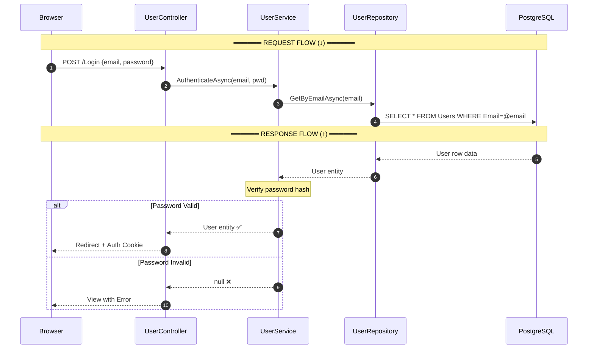

# Login Flow - Request/Response 2 chiều

## Sequence Diagram



---

## Flow Summary

```
           REQUEST (↓)                    RESPONSE (↑)
    ┌─────────────────────┐        ┌─────────────────────┐
    │   POST /Login       │        │   HTML + Cookie     │
    │   {email, password} │        │   hoặc Error View   │
    └─────────┬───────────┘        └─────────▲───────────┘
              │                              │
    ┌─────────▼───────────┐        ┌─────────┴───────────┐
    │ 1️⃣ CONTROLLER        │        │ 1️⃣ CONTROLLER        │
    │ Validate ModelState │        │ Create Cookie       │
    │ Call IUserService   │        │ Return Redirect     │
    └─────────┬───────────┘        └─────────▲───────────┘
              │                              │
    ┌─────────▼───────────┐        ┌─────────┴───────────┐
    │ 2️⃣ SERVICE           │        │ 2️⃣ SERVICE           │
    │ Call IUserRepo      │        │ Verify password     │
    │                     │        │ Return User/null    │
    └─────────┬───────────┘        └─────────▲───────────┘
              │                              │
    ┌─────────▼───────────┐        ┌─────────┴───────────┐
    │ 3️⃣ REPOSITORY        │        │ 3️⃣ REPOSITORY        │
    │ Query DbContext     │        │ Map to Entity       │
    └─────────┬───────────┘        └─────────▲───────────┘
              │                              │
    ┌─────────▼───────────┐        ┌─────────┴───────────┐
    │ DATABASE            │        │ DATABASE            │
    │ SELECT * FROM Users │───────▶│ Return row data     │
    └─────────────────────┘        └─────────────────────┘
```

---

## Code với Comments

```csharp
// ══════ REQUEST FLOW (↓) ══════

// 1️⃣ Controller nhận request
[HttpPost]
public async Task<IActionResult> Login(LoginViewModel model)
{
    // ↓ Gọi xuống Service layer
    var user = await _userService.AuthenticateAsync(model.Email, model.Password);

// 2️⃣ Service xử lý business logic
public async Task<User?> AuthenticateAsync(string email, string password)
{
    // ↓ Gọi xuống Repository layer
    var user = await _userRepository.GetByEmailAsync(email);

// 3️⃣ Repository query database
public async Task<User?> GetByEmailAsync(string email)
{
    // ↓ Gọi xuống Database
    return await _context.Users.FirstOrDefaultAsync(u => u.Email == email);
}

// ══════ RESPONSE FLOW (↑) ══════

// 3️⃣ Database trả về row → Repository map thành Entity
// ↑ Return User entity

// 2️⃣ Service verify password
if (!BCrypt.Verify(password, user.PasswordHash))
    return null;  // ↑ Return null nếu sai
return user;      // ↑ Return User nếu đúng

// 1️⃣ Controller xử lý response
if (user == null)
    return View(model);  // ↑ Trả về Error View
    
await SignInAsync(user);
return RedirectToAction("Index", "Home");  // ↑ Trả về Redirect
```
